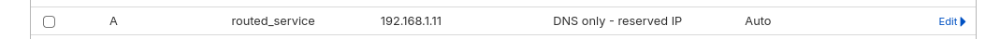

> Thanks to [JimsGarage](https://www.youtube.com/watch?v=CmUzMi5QLzI). Made a [https docs here](https://jalcocert.github.io/JAlcocerT/docs/selfhosting/https/)

1. Get the [Cloudflare API Token](https://dash.cloudflare.com/profile/api-tokens)

2. Get your A record pointing to your server IP (works with public or private IP)

Do this via your registrar, *cloudflare UI for me*, or via command line with [this script](https://github.com/JAlcocerT/Docker/tree/main/Security/DNS/Cloudflare_DNS)



```sh
python3 update_dns.py
```

3. Create the `.env` to access the traefik dashboard

```sh
PASSWORD="YourReallyStrongPassword123!" && echo "TRAEFIK_DASHBOARD_CREDENTIALS=admin:$(htpasswd -nb admin "$PASSWORD" | sed -e 's/\$/\$\$/g')" > .env
```

4. Create acme.json and the network:

```sh
nano ./config/acme.json
chmod 600 /home/jalcocert/Docker/JimsGarage/Traefikv3/config/acme.json

sudo docker network create proxy
```

5. Run the service:

```sh
docker compose -f ytgroq_docker-compose.yml up -d
```